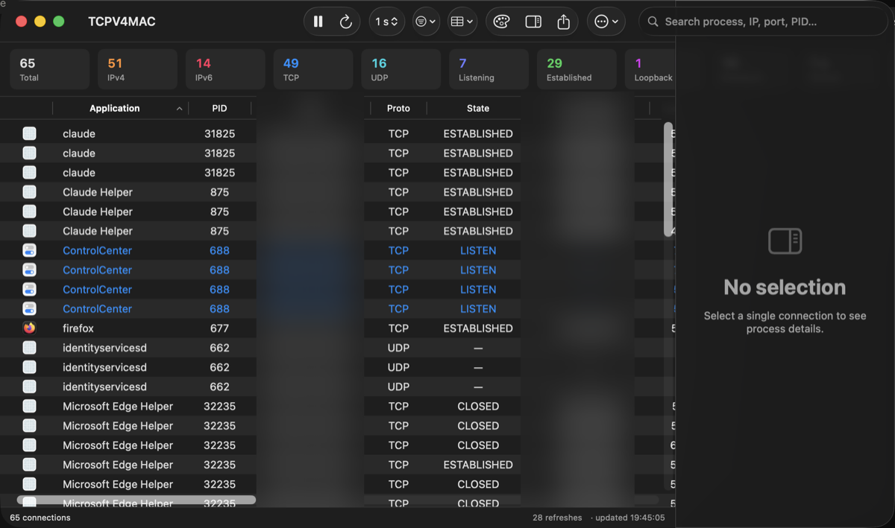
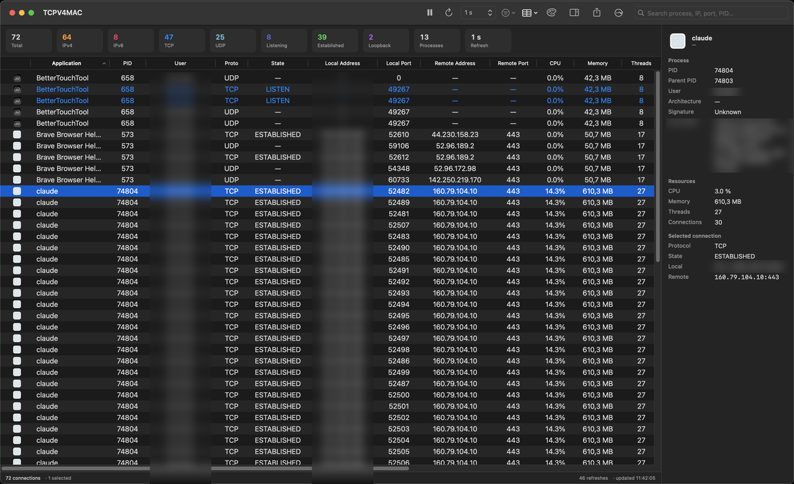

# TCPV4MAC-INTEL

A native macOS app that shows a **real-time graphical view of every TCP and UDP
connection** on the system and the process that owns it — inspired by
Microsoft Sysinternals' *TCPView*, but built from scratch with modern
Apple-native technologies.

This repository is the **Intel (x86_64) compatible fork** of
[TCPV4MAC](https://github.com/jensyleo/TCPV4MAC), whose `main` branch targets
Apple Silicon only. Both projects share the same author and license.

> Original work. **Not affiliated with, endorsed by, or derived from** Microsoft
> or Sysinternals — only inspired by the idea. See [Credits](#credits--inspiration).

> Compatible with **Intel-based Macs (x86_64)**, as well as Apple Silicon
> (arm64) — built and tested as a universal binary. Minimum deployment
> target: **macOS 13 (Ventura)**, chosen specifically so the app keeps
> running on Intel Macs. (The `TCPV4MACCore` engine package stays broadly
> portable.)

## Screenshots

| Live table + dashboard | Inspector |
|---|---|
|  |  |

*Usernames and local IP addresses are blurred for privacy — everything else is
the real, live UI.*

---

## Status

✅ **v1.0 — complete.** A focused, lightweight utility. Deeper analytics (history,
statistics, charts) are intentionally out of scope — those would be a separate,
heavier app.

| Component | State |
|---|---|
| `TCPV4MACCore` — data engine (models, provider, parser, diff, repository) | ✅ 29 unit tests green |
| SwiftUI + AppKit app (NSTableView, inspector, toolbar, dashboard, filters, colors) | ✅ Done |
| Context menu, CSV/JSON copy & export, admin mode, settings, uninstaller | ✅ Done |

## Features

- Live list of every TCP/UDP connection with its owning process.
- Near real-time auto-refresh (configurable 500 ms – 10 s).
- Highlight **new / modified / closed** connections (green / yellow / red).
- Single search box across process, PID, IP, port, bundle id, executable, user, state.
- Filters: TCP/UDP, IPv4/IPv6, listening, established, loopback, etc.
- Inspector panel with full process detail.
- Export to CSV / JSON / TXT.
- Designed for future expansion: history (SQLite), stats, alerts, GeoIP, threat intel.

## Architecture

- **Language / UI:** Swift 6, SwiftUI, Combine, AppKit only where required.
- **Pattern:** MVVM + Repository, Swift Concurrency (`async/await`).
- **Data source is abstracted** behind `ConnectionProvider`; the UI never talks
  to `lsof` directly. The first backend is `LsofProvider` (parses `lsof -F`);
  future backends (nettop, libproc, sysctl, Network.framework, Endpoint
  Security) drop in without touching the UI.

The data engine lives in its own headless Swift package so parsing and diffing
are unit-tested independently of any UI:

```
TCPV4MAC/
  TCPV4MACCore/          Swift package — no UI (see TCPV4MACCore/README.md)
    Sources/TCPV4MACCore/  Models · Providers · Parsers · DiffEngine · Repository
    Sources/tcpv4mac-cli/  Headless smoke tool
    Tests/                XCTest: parser · diff · repository · refresh engine
  App/Sources/          SwiftUI app (App, ConnectionsViewModel, ContentView)
  project.yml           XcodeGen spec (source of truth for the .xcodeproj)
  TCPV4MAC.xcodeproj Generated project (committed for convenience)
  README / LICENSE
```

### Why not sandboxed

The app **cannot use the App Sandbox**: sandboxed apps can neither spawn `lsof`
nor inspect other processes' sockets. It is therefore distributed **outside the
Mac App Store**.

## Build & test

Core (headless, no Xcode needed):

```bash
cd TCPV4MACCore
swift test             # 29 tests: parser · diff · repository · refresh engine
swift run tcpv4mac-cli  # dump live connections from the terminal
```

App (SwiftUI):

```bash
# (Re)generate the Xcode project from project.yml — only needed if you edited it:
xcodegen generate      # brew install xcodegen

xcodebuild -project TCPV4MAC.xcodeproj -scheme TCPV4MAC -configuration Debug build
# or just open TCPV4MAC.xcodeproj in Xcode and Run.
```

> **v1.0** — the full app.

## Uninstall

TCPV4MAC is not sandboxed, so it can fully clean up after itself. Use the in-app
**⋯ → Uninstall TCPV4MAC…** — it removes preferences, saved state, caches and its
Privacy & Security (TCC) permissions, then moves the app to the Trash. If the app
is already gone, run [`Scripts/uninstall.sh`](Scripts/uninstall.sh). No login
items or launch agents are created, so nothing else is left behind.

## Roadmap

- **Phase 1 (MVP):** live list, auto-refresh, search, filters, inspector, process icons, CSV export.
- **Phase 2:** history, statistics, charts, alerts, DNS resolution, whois.
- **Phase 3:** GeoIP, ASN, threat intelligence (VirusTotal / AbuseIPDB / Shodan).
- **Phase 4:** Endpoint Security integration, bandwidth monitor, kill process, close connection.

## Credits & inspiration

**TCPV4MAC** is inspired by
**[Sysinternals TCPView](https://learn.microsoft.com/sysinternals/downloads/tcpview)**
by Microsoft. This project shares no code with it and is an independent,
original implementation for macOS. "TCPView" and "Sysinternals" are trademarks
of Microsoft Corporation; the distinct name **TCPV4MAC** is used to avoid
confusion, and the reference is only to describe the inspiration.

## License

[GNU GPL v3.0](LICENSE) © 2026 Jensy Leonardo Martínez Cruz.

TCPV4MAC is free software: you can redistribute it and/or modify it under the
terms of the **GNU General Public License, version 3**. It is distributed in the
hope that it will be useful, but **WITHOUT ANY WARRANTY**. See the [LICENSE](LICENSE)
file for the full terms.
